# Smart Metering & Loss Analysis Lab

Sistema reproducible para analizar lecturas de medidores eléctricos, calcular pérdidas de energía, detectar sectores críticos y visualizar resultados en tableros, mapas y una API.

El sistema permite comparar la energía que entra a una zona de la red con la energía que registran los medidores dentro de esa misma zona. Cuando la diferencia es alta, el sistema genera alertas para orientar revisiones técnicas, mantenimiento o validación de datos.


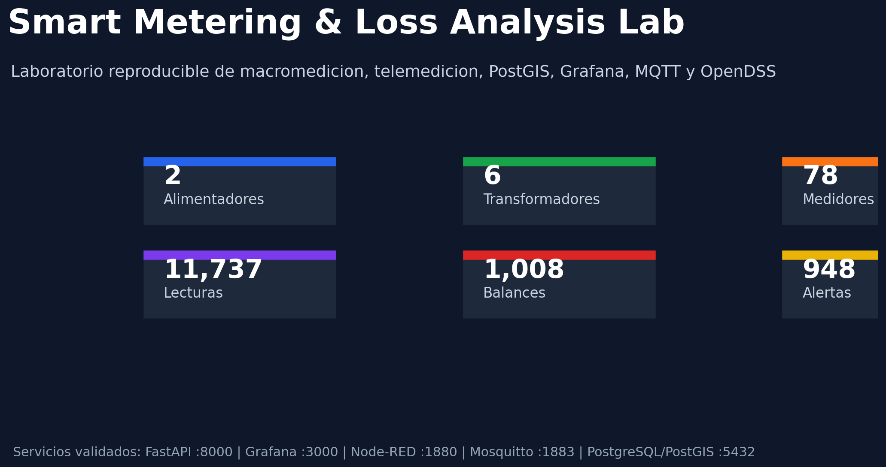


En una red de distribución eléctrica es normal que una parte de la energía se pierda por causas técnicas, errores de medición, fallas de comunicación o posibles consumos no registrados. El reto operativo es saber dónde mirar primero.

Este proyecto organiza esa tarea en un flujo medible:

- recibe lecturas de medidores y macromedidores;
- revisa si faltan lecturas o si hay valores atípicos;
- calcula cuánta energía entró a cada transformador;
- calcula cuánta energía fue medida en los usuarios asociados;
- estima la diferencia en kWh y porcentaje;
- clasifica alertas por pérdida alta, baja disponibilidad o lectura anómala;
- muestra resultados en gráficas, mapas, API y base de datos.

## Cómo funciona

Supongamos un barrio alimentado por un transformador. En la entrada del transformador hay un medidor principal, llamado macromedidor. Dentro del barrio hay muchos medidores individuales.

El sistema hace esta comparación:

```text
energía que entró al transformador
-
energía medida en los usuarios asociados
=
pérdida estimada
```

Si la pérdida estimada supera un umbral, el transformador aparece como prioritario. Si además faltan lecturas o hay medidores con valores extraños, el sistema deja una alerta para revisar la causa.

## Flujo completo

1. Crea una red sintética con alimentadores, transformadores, macromedidores y medidores.
2. Genera lecturas horarias de energía.
3. Simula fallas comunes: lecturas faltantes, lecturas atípicas y eventos de comunicación.
4. Calcula balances energéticos por transformador.
5. Genera alertas operativas.
6. Carga la información en PostgreSQL/PostGIS.
7. Expone consultas por FastAPI.
8. Publica telemetría por MQTT.
9. Permite revisar resultados en Grafana, mapas GIS y archivos CSV.
10. Ejecuta pruebas automáticas para validar que el flujo funcione de punta a punta.

## Trazabilidad

El proyecto está construido con criterios que facilitan una revisión y una futura adaptación a fuentes certificadas:

- datos separados por etapas: activos, lecturas, eventos, balances y alertas;
- identificadores únicos para alimentadores, transformadores y medidores;
- marcas de tiempo en las lecturas;
- reglas explícitas para calcular pérdidas y disponibilidad;
- vistas SQL para consultar el último balance y las alertas abiertas;
- georreferenciación de activos mediante GeoJSON/PostGIS;
- pruebas automatizadas de cálculo, calidad de datos y protocolos;
- validación de servicios con Docker;
- API documentada para consultar resultados;
- simulación eléctrica básica con OpenDSS;
- gráficas y capturas versionadas en el repositorio.

En un entorno real, este mismo flujo se podría alimentar con lecturas de medidores certificados, inventario real de activos, procedimientos internos de la empresa y normativa aplicable. .

## Arquitectura

El siguiente diagrama muestra las piezas principales. Los datos se generan, se validan, se guardan, se analizan y finalmente se muestran para tomar decisiones.

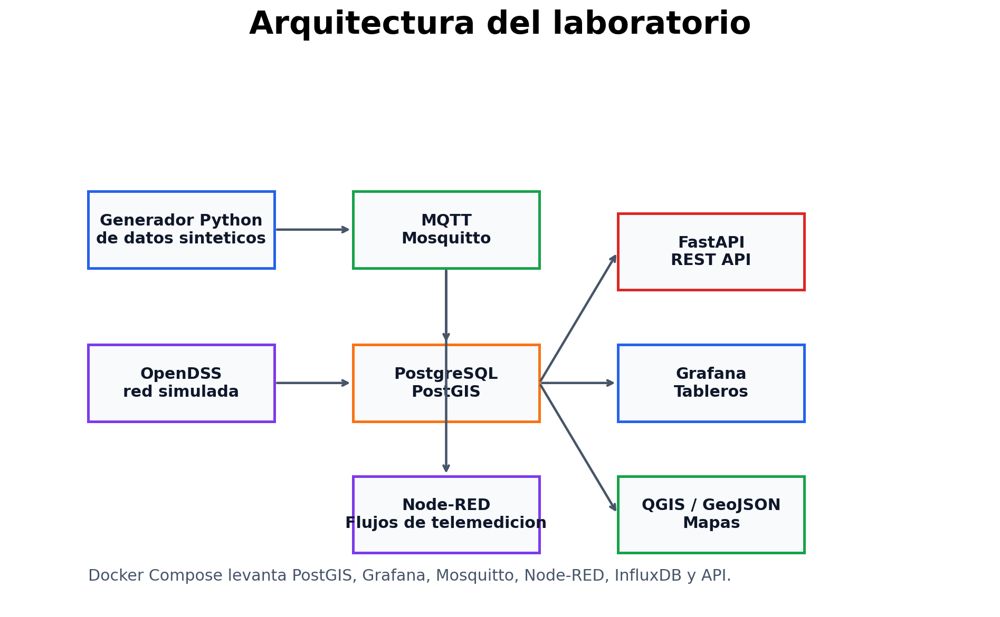

| Componente | Para qué sirve |
|---|---|
| Python | Genera datos, calcula pérdidas, revisa calidad y crea alertas |
| PostgreSQL/PostGIS | Guarda lecturas, activos, balances, alertas y ubicaciones |
| FastAPI | Permite consultar resultados desde un navegador o sistema externo |
| Grafana | Muestra tableros de seguimiento |
| MQTT/Mosquitto | Simula envío de lecturas como lo haría un sistema de telemedición |
| Node-RED | Permite armar flujos visuales de comunicación |
| OpenDSS | Simula una red eléctrica básica |
| GeoJSON/QGIS | Permite ver activos y sectores críticos en un mapa |

## Datos generados

El escenario validado incluye:

- 2 alimentadores.
- 6 transformadores.
- 78 medidores, incluyendo macromedidores.
- 11.737 lecturas horarias de medidores.
- 359 eventos de comunicación.
- 1.008 balances energéticos.
- 948 alertas operativas.
- 86 elementos GIS exportados.

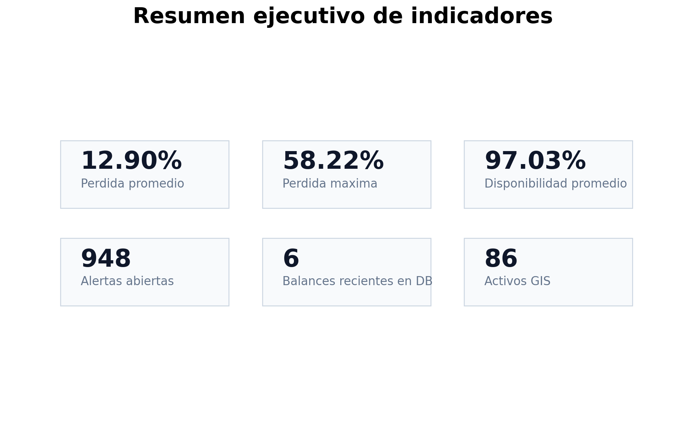

## Indicadores principales

| Indicador | Qué significa |
|---|---|
| Energía suministrada | Energía registrada por el macromedidor de un transformador |
| Energía medida | Suma de la energía registrada por los medidores asociados |
| Pérdida kWh | Diferencia entre energía suministrada y energía medida |
| Pérdida % | Pérdida comparada contra la energía suministrada |
| Disponibilidad de lecturas | Porcentaje de lecturas recibidas frente a las esperadas |
| Alerta de pérdida alta | Aviso cuando la pérdida supera el umbral configurado |
| Alerta de baja disponibilidad | Aviso cuando faltan demasiadas lecturas |
| Lectura atípica | Valor inusual que conviene revisar antes de tomar decisiones |

## Visualizaciones

### Pérdidas por transformador

Cada línea muestra cómo cambia la pérdida de un transformador en el tiempo. La línea roja punteada es el límite definido para marcar pérdida alta.

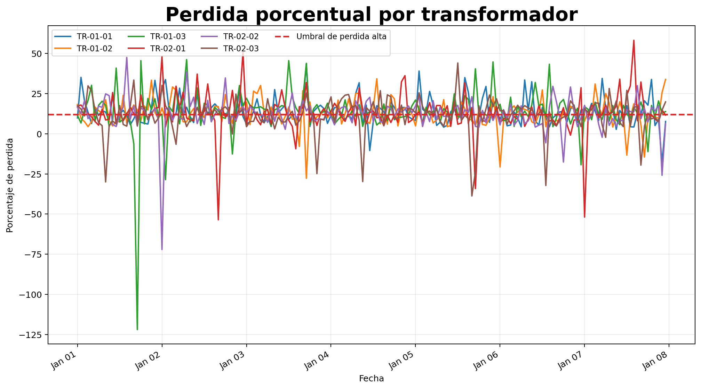

### Balance energético reciente

Compara, para cada transformador, la energía que entró, la energía medida y la diferencia estimada.

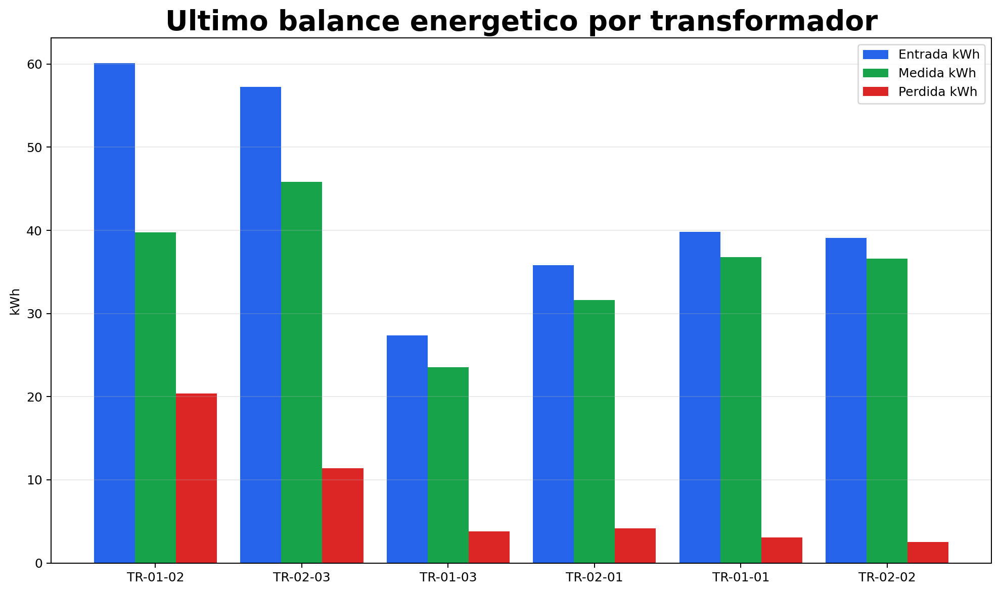

### Disponibilidad de telemedición

Muestra si las lecturas llegaron completas. Un valor bajo no siempre significa pérdida de energía; también puede indicar problemas de comunicación o carga de datos.

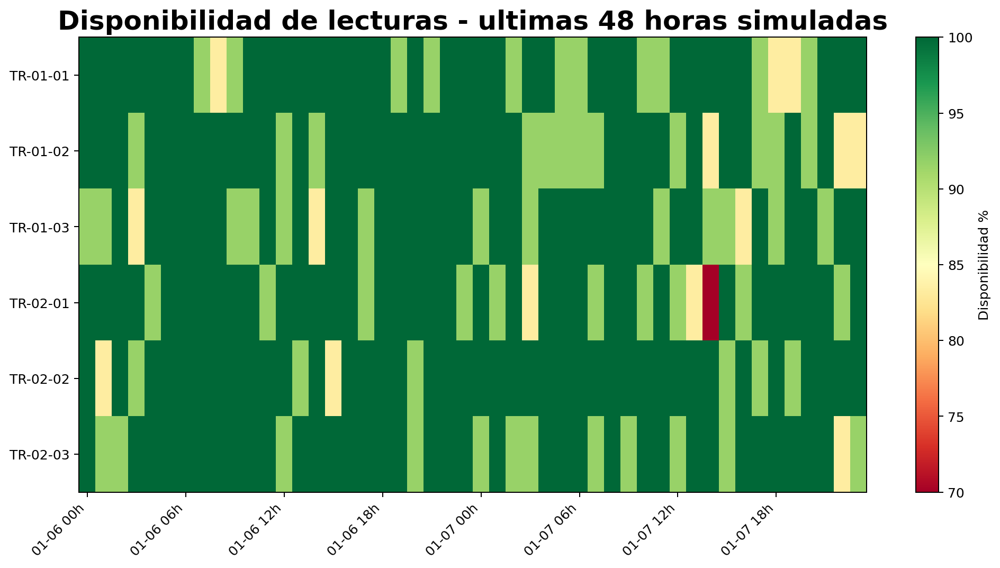

### Ranking de sectores críticos

Ordena los transformadores con mayor pérdida promedio para ayudar a priorizar las visitas o revisiones.

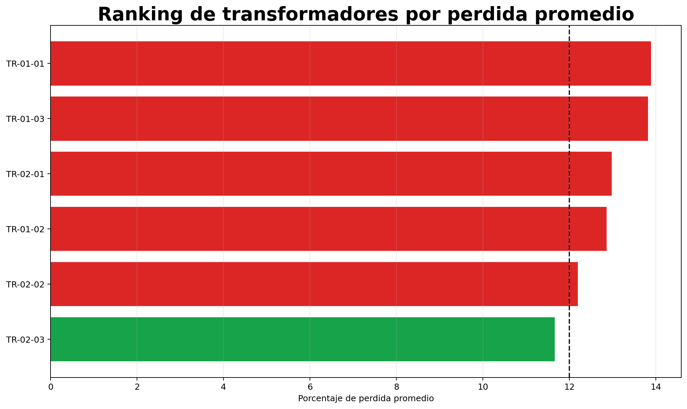

### Alertas operativas

Resume cuántas alertas existen por tipo y severidad.

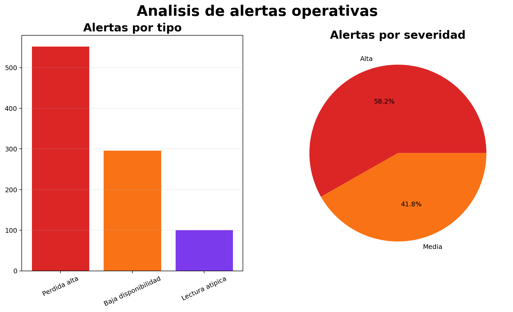

### Mapa GIS de activos

Ubica alimentadores, transformadores, macromedidores y medidores. El color ayuda a identificar zonas con mayor pérdida estimada.

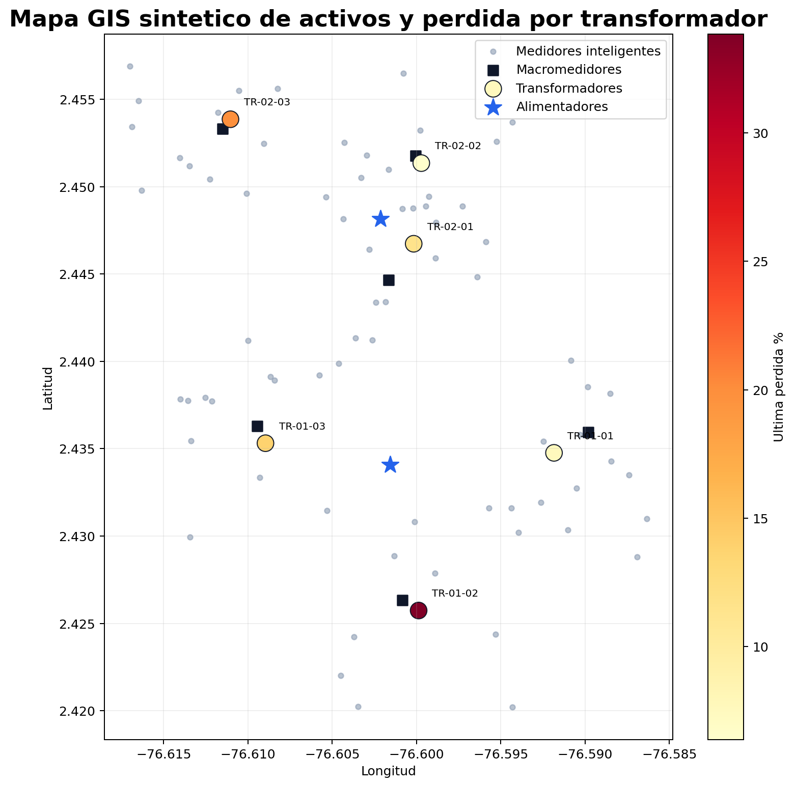

### Modelo de datos

Muestra cómo se relacionan los activos, lecturas, balances y alertas dentro de la base de datos.

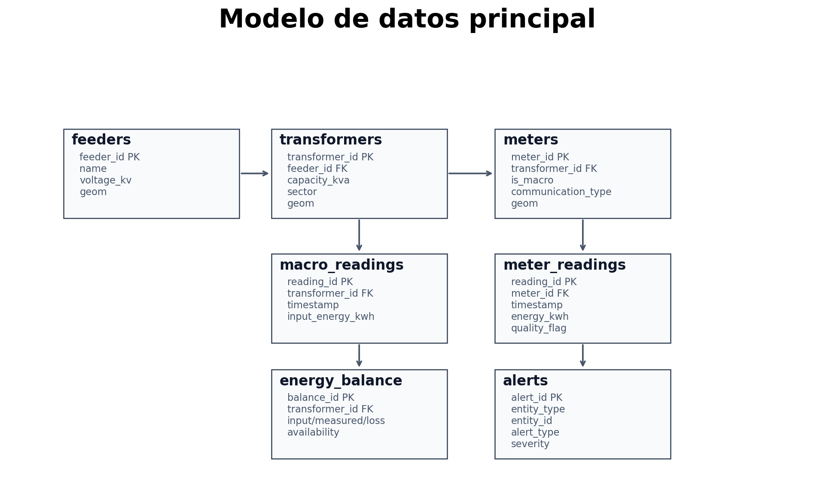

### Validación ejecutada

Resume las pruebas usadas para comprobar que el laboratorio funciona.

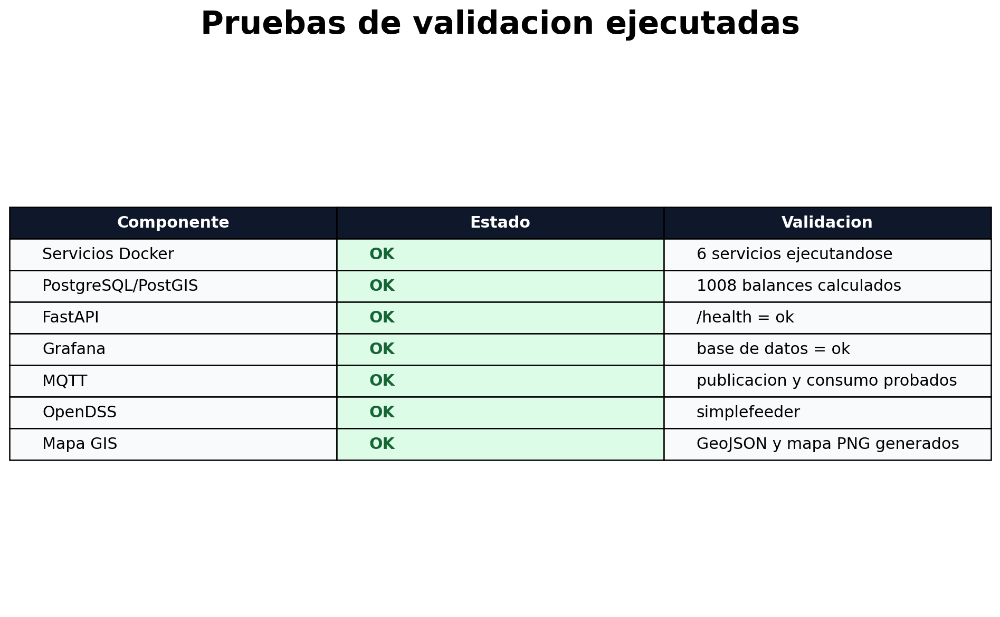

### API REST

La API permite consultar el estado del sistema, los últimos balances y las alertas abiertas.

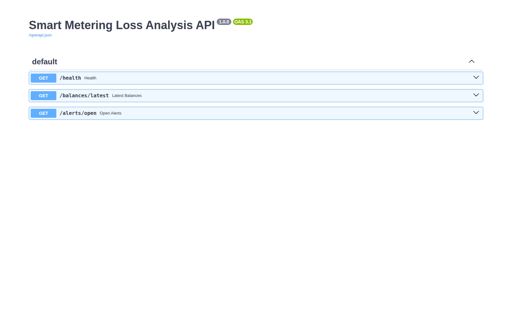

## Estructura del proyecto

```text
.
├── data/
│   ├── synthetic/              # datos sintéticos generados
│   └── processed/              # balances y alertas calculadas
├── dashboards/grafana/         # dashboard y configuración de Grafana
├── docs/
│   └── screenshots/            # imágenes usadas en este README
├── maps/                       # archivo GeoJSON para mapas
├── mqtt/                       # configuración de Mosquitto
├── opendss/                    # caso básico OpenDSS
├── scripts/                    # ejecución y generación de demo
├── sql/                        # esquema, vistas y consultas SQL
├── src/                        # código Python del laboratorio
└── tests/                      # pruebas automatizadas
```

## Cómo ejecutarlo

Requisitos:

- Python 3.11 o superior.
- Docker y Docker Compose.
- Git.

Crear entorno local:

```bash
python3 -m venv .venv
source .venv/bin/activate
pip install -r requirements.txt
```

Ejecutar el flujo local sin contenedores:

```bash
./scripts/run_local_mvp.sh
```

Levantar el laboratorio completo:

```bash
./scripts/run_docker_stack.sh
```

El script prepara los datos, calcula indicadores, levanta los servicios, carga la base de datos y ejecuta pruebas de funcionamiento.

## URLs locales

Con Docker ejecutándose:

| Servicio | URL |
|---|---|
| FastAPI Swagger | http://localhost:8000/docs |
| Grafana | http://localhost:3000 |
| Dashboard Grafana | http://localhost:3000/d/smart-metering-loss/smart-metering-loss-analysis |
| Node-RED | http://localhost:1880 |
| PostgreSQL/PostGIS | localhost:5432 |
| Mosquitto MQTT | localhost:1883 |

Credenciales de Grafana:

```text
usuario: admin
clave: admin
```

## Comandos útiles

Diagnóstico del entorno:

```bash
python -m src.doctor --require-docker
```

Regenerar imágenes de demo:

```bash
python scripts/generate_demo_images.py
```

Ejecutar pruebas:

```bash
pytest
ruff check .
black --check src tests scripts
```

Consultar la API:

```bash
curl http://localhost:8000/health
curl http://localhost:8000/balances/latest
curl http://localhost:8000/alerts/open
```

Apagar servicios:

```bash
docker-compose down
```

## Validación realizada

El proyecto fue probado con:

- `pytest`: 18 pruebas automatizadas.
- `ruff`: análisis estático.
- `black --check`: formato.
- `docker-compose config`: validación de Compose.
- Smoke test de PostgreSQL/PostGIS.
- Smoke test MQTT publish/subscribe.
- FastAPI contra PostgreSQL.
- Grafana conectado a PostgreSQL.
- Node-RED levantado.
- OpenDSS ejecutando el circuito simple.


